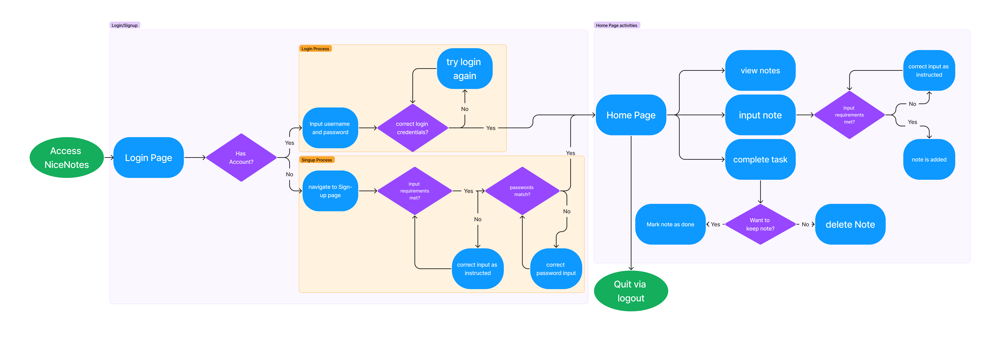

[Jane Dane]
{: .label }

# [App behavior]
{: .no_toc }

  

    Table of contents
  

  {: .text-delta }
  
- [Registrierung](#registrierung)  
- [Anmeldung nach Registrierung](#anmeldung-nach-registrierung)  
- [Home-Ansicht](#home-ansicht)  
- [User flow Diagramm](#user-flow-diagramm)
  
{:toc}

## Registrierung:
Beim ersten Besuch von NiceNotes landen neue Benutzer auf der Login-Seite.  
Um sich anzumelden, müssen sie ein Benutzerprofil erstellen.  
In der Navbar gibt es einen Button, der zur Registrierungsansicht führt.  Solange der Benutzer noch nicht registriert ist, wird er in der Navbar als "Gast" begrüßt.  
Eingaben in den Registrierungsfeldern müssen den vorgegebenen Formatierungen entsprechen. Andernfalls wird der Benutzer aufgefordert, die Eingaben entsprechend anzupassen.  
Wenn alle Eingaben den Anforderungen entsprechen, wird geprüft, ob die eingegebenen Passwörter übereinstimmen.   Andernfalls erhält der Benutzer eine entsprechende Benachrichtigung.  
Nach erfolgreicher Validierung der Eingaben wird der Benutzer registriert.   Sein Profil wird in der Datenbank mit einer eindeutigen ID erstellt, und er erhält eine Bestätigung über den erfolgreichen Vorgang.  
Schließlich wird der nun registrierte Benutzer zur Home-Ansicht weitergeleitet.

## Anmeldung nach Registrierung:
Bei zukünftigen Besuchen können registrierte Benutzer sich direkt von der Login-Seite aus anmelden, sofern sie die korrekten Anmeldedaten eingeben.

## Home-Ansicht:
Nach dem Anmelden erreichen Benutzer die Home-Ansicht.  
Hier können sie ihre gespeicherten Notizen anzeigen lassen.  
Es besteht die Möglichkeit, neue Notizen in das dafür vorgesehene Eingabefeld einzugeben und in der Datenbank zu speichern.  
Benutzer können außerdem ihre Notizen als "erledigt" markieren und den Status von Aufgaben ändern.   Dies erfolgt durch eine spezielle Schaltfläche.  
Wenn Benutzer Notizen eingeben und diese als "erledigt" markieren, wird der Fortschritt mithilfe einer Fortschrittsanzeige visualisiert.   Diese Anzeige wird durch die Verwendung einer Bootstrap Progressbar implementiert.  
Der Nutzer kann zwischen einer hellen und dunklen Benutzeroberfläche entscheiden, indem er das entsprechende Bedienelement in der Navbar verwendet.  
Die Notizen werden nach ihrem Status in seperaten Listen angezeigt, eine Liste hält die unerledigten, die andere die erledigten Notizen.

## User flow Diagramm 

