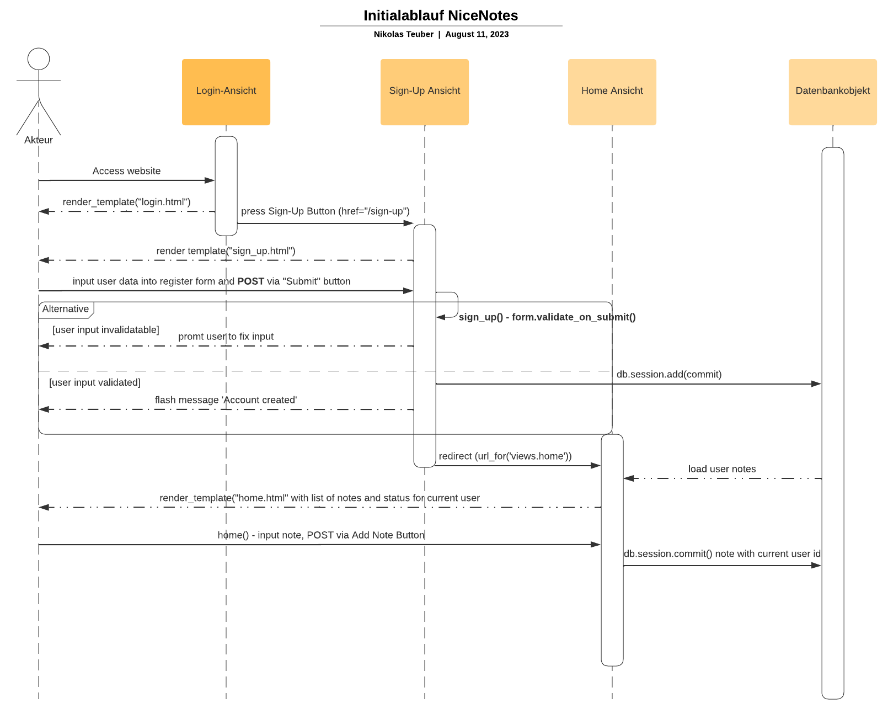

[Jane Dane]
{: .label }

# [App structure, incl. context]
{: .no_toc }

  

    Table of contents
  

  {: .text-delta }
  
- [Basistemplate und Navigationsleiste](#basistemplate-und-navigationsleiste)
- [Templates für verschiedene Ansichten](#templates-für-verschiedene-ansichten)
- [User-Session-Management und Authentifizierung](#user-session-management-und-authentifizierung)
- [Datenbankinteraktion](#datenbankinteraktion)
- [Benachrichtigungen und Interaktion mit Benutzern](#benachrichtigungen-und-interaktion-mit-benutzern)
- [Navigation und Interaktion](#navigation-und-interaktion)
- [Sequenceflow Diagramm Initialnutzung](#sequenceflow-diagramm-initialnutzung)

{:toc}

## Basistemplate und Navigationsleiste
NiceNotes ist eine Webanwendung zur Erstellung von Notizen, die auf dem Flask-Framework aufgebaut ist.  
Die App verwendet ein Basistemplate, das als Grundlage für alle Ansichten dient.  
In der Navigationsleiste (Navbar) werden abhängig vom angemeldeten Benutzer verschiedene Navigationsmöglichkeiten angezeigt.  
Die Navigationsleiste ermöglicht es Benutzern, leicht zwischen verschiedenen Abschnitten der App zu wechseln.

## Templates für verschiedene Ansichten
Das Basistemplate wird durch drei weitere Templates erweitert, um spezifische Ansichten für die Benutzer bereitzustellen.  
Diese Ansichten decken die Anmeldung, die Registrierung sowie das Erstellen und Ansehen von Notizen ab.

## User-Session-Management und Authentifizierung
Für das User-Session-Management wird die Flask-Erweiterung Flask-Login verwendet.  
Der Benutzerstatus wird mithilfe der UserMixin-Klasse implementiert, um sicherzustellen, dass Benutzer angemeldet bleiben und auf geschützte Funktionen zugreifen können.

## Datenbankinteraktion
Die App kommuniziert mit der Datenbank über die SQLAlchemy-Bibliothek.  
Die Datenbank wird als Instanz der SQLAlchemy-Klasse verwaltet, was eine effiziente und sichere Datenhaltung ermöglicht.

## Benachrichtigungen und Interaktion mit Benutzern
Flash-Nachrichten in Flask werden genutzt, um die Kommunikation zwischen der App und dem Benutzer zu erleichtern.
Benutzer erhalten Rückmeldungen über abgeschlossene Aktionen oder etwaige Fehler.

## Navigation und Interaktion
Der Benutzer navigiert zwischen den verschiedenen Ansichten, indem er Schaltflächen betätigt, die POST-Anfragen senden oder als Navigationslinks dienen.

## Sequenceflow Diagramm Initialnutzung

