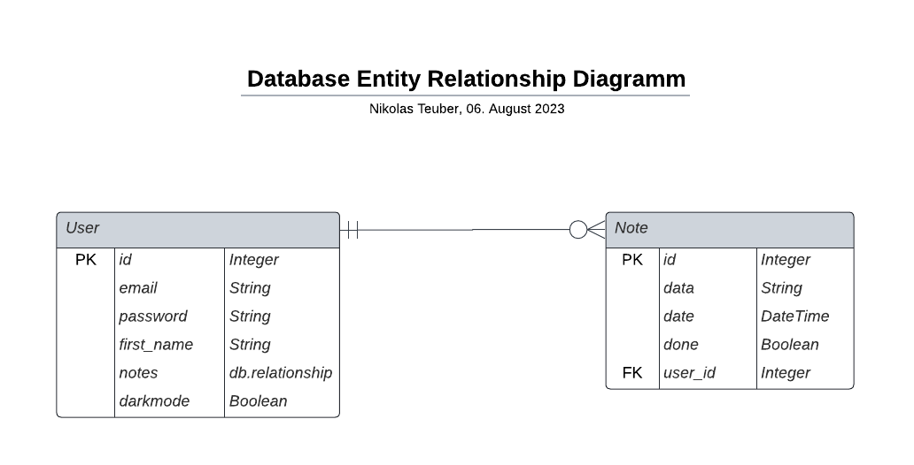

[Jane Dane]
{: .label }

# [Data model]
{: .no_toc }

  

    Table of contents
  

  {: .text-delta }
  
- [Beschreibung der Datenklassen:](#beschreibung-der-datenklasse)
  - [Notiz-Klasse](#notiz-klasse)
  - [User-Klasse](#user-klasse)
    
{:toc}

## Beschreibung der Datenklassen:
In NiceNotes gibt es die Klassen Note und User. Beide sind SQLAlchemy Datenbank-Modelklassen

## Notiz-Klasse

**Zweck:**

Die Klasse Note ist die Klasse für die Notizen und erbt von der db.Model-Klasse, welche wiederum eine SQLalchemy Modelklasse ist.

Die Note Klasse hat folgende Spalten:
---
**Id:** ist eine Spalte vom Datentyp Integer und dient als PrimaryKey. Jede Notiz hat somit einen eindeutigen Identifikator.  
**Data:** ist die Spalte für Notizen und hat den Datentyp String und hat eine maximale Zeichenlänge von 10.000 Zeichen.  
**Date:** ist eine Spalte mit dem DateTime Datentyp und hält somit Tag und Uhrzeit. Mit der sql now() datetime function
wird die Datum und aktuelle Uhrzeit in der Spalte gespeichert.  
**Done:** ist eine Spalte vom Datentyp Boolean. Sie fungiert als done-flag und hält den Status der Notiz  
**User_id:** ist eine Spalte vom Datentyp Integer und speichert den foreign-Key, welcher auf die Userin verweist, zu der die Notiz gehört.

## User-Klasse

**Zweck:**

Die Klasse User ist die Klasse für die Userinnen Notizen und erbt von der db.Model-Klasse, welche wiederum eine SQLalchemy Modelklasse ist. 
Außerdem erbt die Userklasse UserMixin, welche weitere Eigenschaften implementiert wie is_authenticated, is_anonymous und andere.
 

Die User Klasse hat folgende Spalten:
---
**Id:** ist eine Spalte vom Datentyp Integer und dient als PrimaryKey. Jede Notiz hat somit einen eindeutigen Identifikator.  
**Email:** ist eine Spalte vom Typ String und hat eine Maximallänge von 150 Zeichen. Der Wert unique=true besagt, 
dass jede Email innerhalb der Tabelle eindeutig sein muss.  
**Password:** ist eine Spalte vom Typ String mit einer Maximallänge von 150 Zeichen.  
**First_name:** ist eine Spalte vom Typ String mit einer Maximallänge von 150 Zeichen  
>> Notes: ist eine Spalte die die Datenbankbeziehung zwischen der Notiz- und UserKlasse setzt. 

## Datenbank Entity Relationship Diagramm

